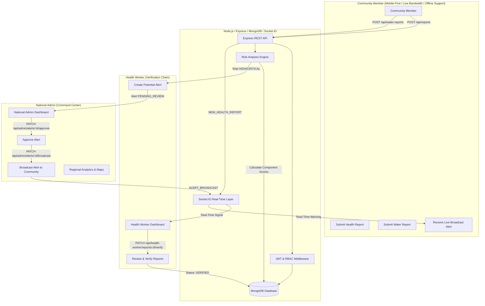

# SmartHealthNE — Smart Community Health Monitoring & Early Warning System

> **Smart India Hackathon (SIH) Prototype**  
> A community health reporting and early warning platform designed for rural Northeast India, focusing on **water-related health risks**, early outbreak detection, health-worker verification, real-time alert broadcasts, and administrative analytics.

---

## ⚠️ Important Public Health Disclaimer
**SmartHealthNE is a public-health monitoring and early warning tool.**  
- Risk scores generated by this system are **monitoring indicators** for public-health administrators and health workers.
- **This application is NOT a medical diagnosis tool.**
- Health reports capture symptoms and environmental observations only — **never a disease diagnosis**.

---

## 1. System Architecture Diagram



---

## 2. Core Early-Warning Workflow

```
Community Member
  ↓
Health / Symptom / Water Report
  ↓
Backend Validation & Mongo Storage
  ↓
Risk Analysis Engine (Auto-Calculation)
  ↓
Potential Risk Detection (HIGH / CRITICAL)
  ↓
Health Worker Review & Field Verification
  ↓
National Admin Approval & Authorization
  ↓
Real-Time Community Alert Broadcast (Socket.IO)
  ↓
Public Prevention & Awareness Guidance
```

---

## 3. Technology Stack

- **Frontend:** React, Vite, Tailwind CSS, React Router v6, Axios, Recharts, Leaflet / React-Leaflet, Socket.IO Client, i18next (English, Hindi, Assamese, Bengali), Vite-PWA.
- **Backend:** Node.js, Express.js, MongoDB + Mongoose, JWT, bcryptjs, Socket.IO.
- **Security & Reliability:** Helmet, CORS whitelist, express-rate-limit, express-validator, input sanitization, centralized error handling.

---

## 4. Risk Analysis Engine Formula

Stored and computed in `server/services/riskEngine.js`.

$$\text{riskScore} = (\text{symptomScore} \times 0.40) + (\text{growthScore} \times 0.25) + (\text{waterScore} \times 0.20) + (\text{clusterScore} \times 0.15)$$

All component scores are normalized to **0–100**.

| Score Range | Risk Level | Meaning |
|---|---|---|
| 0 – 30 | **LOW** | Normal background level |
| 31 – 60 | **MEDIUM** | Moderate increase in observations |
| 61 – 80 | **HIGH** | Significant risk signal — triggers potential alert |
| 81 – 100 | **CRITICAL** | Emergency level — urgent field inspection needed |

### Components:
1. **Symptom Score (40%):** Weighted concentration of diarrhea, vomiting, dehydration, fever, and stomach pain in the last 7 days.
2. **Growth Score (25%):** Percentage increase over previous 7-day baseline:
   $$\text{growthRate} = \frac{\text{current7d} - \text{previous7d}}{\max(\text{previous7d}, 1)} \times 100$$
   *Zero-baseline safe fallback:* If previous = 0 and current > 0, score scales safely without throwing division-by-zero errors.
3. **Water Score (20%):** Contamination severity from water issue reports in the village.
4. **Cluster Score (15%):** Geographic concentration of reports within a 48-hour window.

---

## 5. Security & RBAC Enforcement

Role-Based Access Control is **strictly enforced server-side** via `middleware/requireAuth.js` and `middleware/requireRole.js`:
- `COMMUNITY_MEMBER`: Can submit reports, view broadcast alerts, view own history, learn.
- `HEALTH_WORKER`: Can review pending reports in district, verify/reject, view village risk, create potential alerts.
- `NATIONAL_ADMIN`: Access to regional analytics, command map, user management, and **final alert approval & broadcast authorization**.

---

## 6. Installation & Demo Execution Guide

### Prerequisites
- Node.js (v18+)
- MongoDB running locally on `mongodb://localhost:27017` (or MongoDB Atlas URI)

### Quick Start (Single Command)
```bash
# 1. Install root, server, and client dependencies
npm run install:all

# 2. Seed realistic demo data (3 demo accounts, 65+ health reports, 25+ water reports)
npm run seed

# 3. Start Express server + React Vite client concurrently
npm run dev
```

The apps will be available at:
- **Frontend App:** http://localhost:5173
- **Backend API:** http://localhost:5000/api/ping

---

## 7. Demo Accounts for SIH Evaluators

| Role | Email | Password |
|---|---|---|
| **Community Member** | `community@smarthealthne.demo` | `Demo@1234` |
| **Health Worker** | `worker@smarthealthne.demo` | `Demo@1234` |
| **National Admin** | `admin@smarthealthne.demo` | `Demo@1234` |

---

## 8. Step-by-Step Acceptance Demo Scenario

1. **Sign in as Community Member:** (`community@smarthealthne.demo`)
2. Go to **Report Symptom** → Submit a report for *Majuli Village* with diarrhea & vomiting.
3. **Automated Risk Engine:** System recalculates Majuli Village risk score → reaches **HIGH** (72/100).
4. **Health Worker Real-Time Notification:** Open a second window, login as `worker@smarthealthne.demo`. Notice real-time dashboard alert for *Majuli Village*.
5. Go to **Reports Queue** → Click **Verify** on pending reports and enter field notes.
6. Go to **Alerts** → Verify the potential alert to escalate it to National Admin.
7. **National Admin Approval:** Open a third window/incognito, login as `admin@smarthealthne.demo`.
8. Go to **Alert Approval** → Click **Approve Alert**, then click **Broadcast Live to Community**.
9. **Real-Time Community Delivery:** Return to Community window — the **HIGH Risk Alert banner** appears live without refreshing the page!
10. **Analytics & Map Update:** Admin & Health Worker maps turn RED for Majuli Village and analytics charts reflect live MongoDB totals.

---

## 9. API Reference Summary

- `POST /api/auth/register` & `POST /api/auth/login` — Authentication & JWT generation
- `POST /api/reports` & `GET /api/reports` — Health report submission & queue retrieval
- `POST /api/water-reports` & `GET /api/water-reports` — Water issue reports
- `PATCH /api/health-worker/reports/:id/verify` — Health worker verification
- `GET /api/health-worker/risk` — Village risk score assessments
- `PATCH /api/admin/alerts/:id/approve` — Admin alert approval
- `PATCH /api/admin/alerts/:id/broadcast` — Admin real-time broadcast trigger
- `GET /api/admin/analytics` — Cross-region aggregation metrics
- `GET /api/awareness` — Multilingual public health educational guidelines
