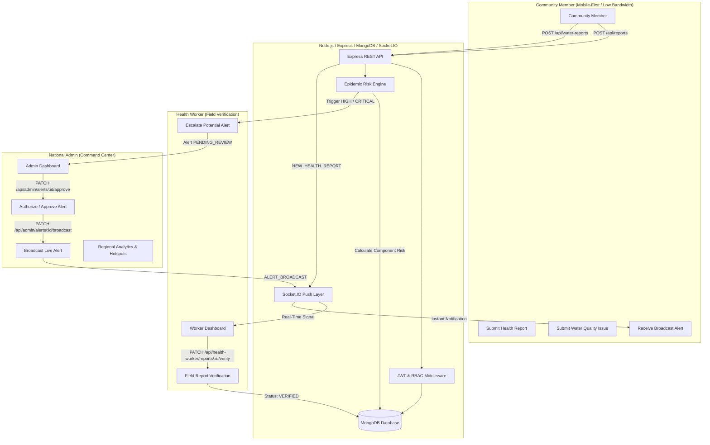

# 🏥 SmartHealthNE — Community Health Monitoring & Outbreak Early Warning Platform

<div align="center">

[](https://opensource.org/licenses/MIT)
[](https://www.sih.gov.in/)
[](https://nodejs.org/)
[](https://react.dev/)
[](https://www.mongodb.com/)
[](https://socket.io/)
[](https://tailwindcss.com/)

**Smart India Hackathon (SIH) Prototype**  
*A community health reporting and early warning system for rural Northeast India focusing on water-borne outbreak detection, health-worker verification, and live administrative alerts.*

[Report Bug](https://github.com/biswajeet-bishoyi/SmartHealth/issues) • [Request Feature](https://github.com/biswajeet-bishoyi/SmartHealth/issues)

</div>

---

## ⚠️ Public Health Disclaimer

**SmartHealthNE is a public health surveillance and early warning platform.**  
- Risk scores generated by this system are **epidemiological monitoring indicators** intended for health administrators and frontline field workers.
- **This application is NOT a medical diagnosis tool.**
- Health reports capture reported symptoms and environmental indicators only — **never a definitive disease diagnosis**.

---

## 🌟 System Architecture


```mermaid
flowchart TD
    subgraph Community ["Community Member (Mobile-First / Low Bandwidth)"]
        CM[Community Member]
        SR[Submit Health Report]
        WR[Submit Water Quality Issue]
        CA[Receive Broadcast Alert]
    end

    subgraph Backend ["Node.js / Express / MongoDB / Socket.IO"]
        API[Express REST API]
        JWT[JWT & RBAC Middleware]
        DB[(MongoDB Database)]
        RE[Epidemic Risk Engine]
        NS[Socket.IO Push Layer]
    end

    subgraph HealthWorker ["Health Worker (Field Verification)"]
        HW[Worker Dashboard]
        VR[Field Report Verification]
        PA[Escalate Potential Alert]
    end

    subgraph Admin ["National Admin (Command Center)"]
        NA[Admin Dashboard]
        AP[Authorize / Approve Alert]
        BC[Broadcast Live Alert]
        AN[Regional Analytics & Hotspots]
    end

    CM -->|POST /api/reports| API
    CM -->|POST /api/water-reports| API
    API --> JWT --> DB
    API --> RE
    RE -->|Calculate Component Risk| DB
    RE -->|Trigger HIGH / CRITICAL| PA
    
    API -->|NEW_HEALTH_REPORT| NS
    NS -->|Real-Time Signal| HW
    
    HW -->|PATCH /api/health-worker/reports/:id/verify| VR
    VR -->|Status: VERIFIED| DB
    PA -->|Alert PENDING_REVIEW| NA
    
    NA -->|PATCH /api/admin/alerts/:id/approve| AP
    AP -->|PATCH /api/admin/alerts/:id/broadcast| BC
    BC -->|ALERT_BROADCAST| NS
    NS -->|Instant Notification| CA
```

---

## 🧮 Epidemiological Risk Engine Formula

Computed continuously in `server/services/riskEngine.js`:

$$\text{Risk Score} = (\text{Symptom Score} \times 0.40) + (\text{Growth Score} \times 0.25) + (\text{Water Score} \times 0.20) + (\text{Cluster Score} \times 0.15)$$

All component scores are normalized to **0 – 100**.

| Score Range | Risk Level | Meaning |
|---|---|---|
| **0 – 30** | 🟢 **LOW** | Baseline endemic background |
| **31 – 60** | 🟡 **MEDIUM** | Moderate rise in reported symptoms |
| **61 – 80** | 🟠 **HIGH** | Significant risk — escalates alert to admin queue |
| **81 – 100** | 🔴 **CRITICAL** | Outbreak signal — urgent field deployment needed |

---

## 🛡️ Role-Based Access Control (RBAC)

- `COMMUNITY_MEMBER`: Submit symptom & water reports, receive emergency alerts, view multilingual preventive guidelines.
- `HEALTH_WORKER`: Access village queue, verify ground veracity of symptom clusters, escalate potential outbreak alerts.
- `NATIONAL_ADMIN`: Access command map, review regional analytics, approve and broadcast emergency warnings.

---

## 🛠️ Quick Start

### Prerequisites
- Node.js >= 18.0.0
- MongoDB instance running locally on `mongodb://localhost:27017` (or MongoDB Atlas URI)

### Single-Command Setup

```bash
# 1. Clone repository
git clone https://github.com/biswajeet-bishoyi/SmartHealth.git
cd SmartHealth

# 2. Install all dependencies across root, server, and client
npm run install:all

# 3. Seed realistic demo data (3 demo accounts, 65+ health reports)
npm run seed

# 4. Start backend API and frontend client concurrently
npm run dev
```

The apps will launch at:
- **Frontend Web App:** `http://localhost:5173`
- **Backend API:** `http://localhost:5000/api/ping`

---

## 🔑 Demo Evaluator Accounts

| Role | Email | Password |
|---|---|---|
| **Community Member** | `community@smarthealthne.demo` | `Demo@1234` |
| **Health Worker** | `worker@smarthealthne.demo` | `Demo@1234` |
| **National Admin** | `admin@smarthealthne.demo` | `Demo@1234` |

---

## 📄 License

This project is licensed under the **MIT License** — see the [LICENSE](LICENSE) file for details.

---

<div align="center">
Developed by <a href="https://github.com/biswajeet-bishoyi">Biswajeet Bishoyi</a> & SIH Team
</div>
